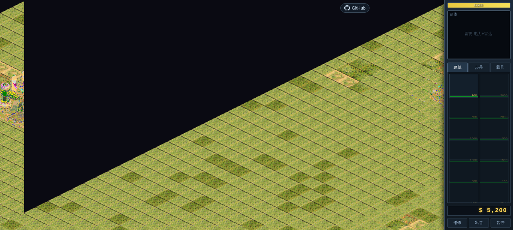

# 红色警戒2 · Web 复刻版 (Web Red Alert 2)

> 基于《命令与征服：红色警戒2》原版素材的网页复刻。**单 HTML 文件即可运行完整游戏**。

**[立即游玩](redalert2.html)** — 下载 `redalert2.html`（约 15MB），双击用浏览器打开即可开战，无需安装任何东西。



## 特性

### 原版素材，极致还原
- **原版 3D 体素单位**：直接解包 RA2 的 `vxl.mix`（VXL/HVA 体素模型），以原版相机参数（α=30°、β=45° 正交投影）离线渲染成 32 朝向精灵图，含独立旋转炮塔与队伍配色
- **原版建筑**：从游戏剧场包提取 SHP 序列帧，还原盟军/苏军全部 24 种建筑
- **原版地形**：等距 TMP 瓦片（60×30），草地/水域/海岸/矿石/宝石原版贴图
- **原版语音**：222 条 EVA 战场播报（盟军/苏军双语音）+ 全套单位战斗语音
- **原版音效**：`audio.bag` 中 1153 条音效，按 `sound.ini` 事件精确映射（每种武器使用其原版开火音）
- **原版数值**：`rules.ini` 直读——血量/造价/伤害/射程/速度/科技树全部采用原版数据
- **原版中文**：`general.csf` 官方简体中文字符串（4480 条）

### 完整玩法
- 盟军 / 苏军双阵营遭遇战，三档 AI 难度
- 经典建造流程：建筑排队 → 就绪 → 战场网格放置
- 采矿经济：矿车自动寻矿、回精炼厂卸矿；矿石会随开采耗尽
- 单位生产（步兵 8 向行走动画 / 载具 32 向 + 炮塔独立瞄准）
- 战斗：A* 寻路、弹道与特效（炮弹 / 光棱 / 磁暴电弧 / 核爆蘑菇云）
- 超级武器：**核弹**、**铁幕装置**、**超时空传送**
- 框选 / 右键指令 / 攻击移动 / 维修 / 出售 / 雷达小地图
- 电力系统（低电力减速生产）、胜负判定、战报统计

## 快速开始

### 玩家
```
open redalert2.html        # 或直接双击
```

### 开发者
```bash
# 源码目录
ra2web/          # index.html + data.js + game.js（开发版，外链素材）
assets_ra2/      # 预渲染图集与音频（由素材管线生成，不入库）

# 本地开发
cd ra2web && python3 -m http.server 8777
# 打包单文件（内嵌全部素材为 base64）
python3 scripts/build_single.py   # -> download/redalert2.html
```

### 素材管线（原版文件 → Web 素材）
全部为自研 Python 解码器，详见 `scripts/`：

| 脚本 | 功能 |
|------|------|
| `mix2.py` / `ra2lib.py` | TS/RA2 MIX 归档、SHP/VXL/HVA/TMP/CSF/PAL 格式解析 |
| `gen_units.py` | VXL 体素 → 32 朝向精灵图集（z-buffer + 2×2 splat + 超采样抗锯齿 + 队伍色重映射） |
| `gen_infantry.py` | 步兵 SHP 序列（站立/行走/开火/死亡）+ cameo 图标 |
| `gen_buildings.py` | 建筑 SHP + 等距地形瓦片图集 |
| `gen_overlays.py` | 矿石/宝石/围墙 overlay |
| `parse_rules.py` | rules.ini / art.ini → JSON 数值表 |
| `build_audio.py` | audio.bag (IMA ADPCM) → OGG；EVA 语音提取 |
| `gen_gamedata.py` | 汇总生成 `data.js` 游戏数据 |
| `build_single.py` | 全部素材 base64 内嵌 → 单 HTML |

素材来源：RA2 官方 MIX 归档（需自行拥有游戏版权）；`THEME.MIX` 音乐未包含在内。

## 技术栈

纯原生 **HTML5 Canvas + Web Audio API**，零依赖、零框架。
渲染使用等距瓦片（60×30）画家算法排序，30fps 逻辑 + requestAnimationFrame 绘制。

## 目录结构

```
redalert2.html   # 单文件完整游戏（主交付物）
ra2web/          # 开发源码（引擎 ~2200 行 JS）
scripts/         # 素材管线与构建脚本（Python）
docs/            # 截图
```

## 免责声明

本项目为情怀复刻与技术学习用途。Red Alert 2 及其全部素材版权归 **Electronic Arts / Westwood Studios** 所有。请支持正版。
